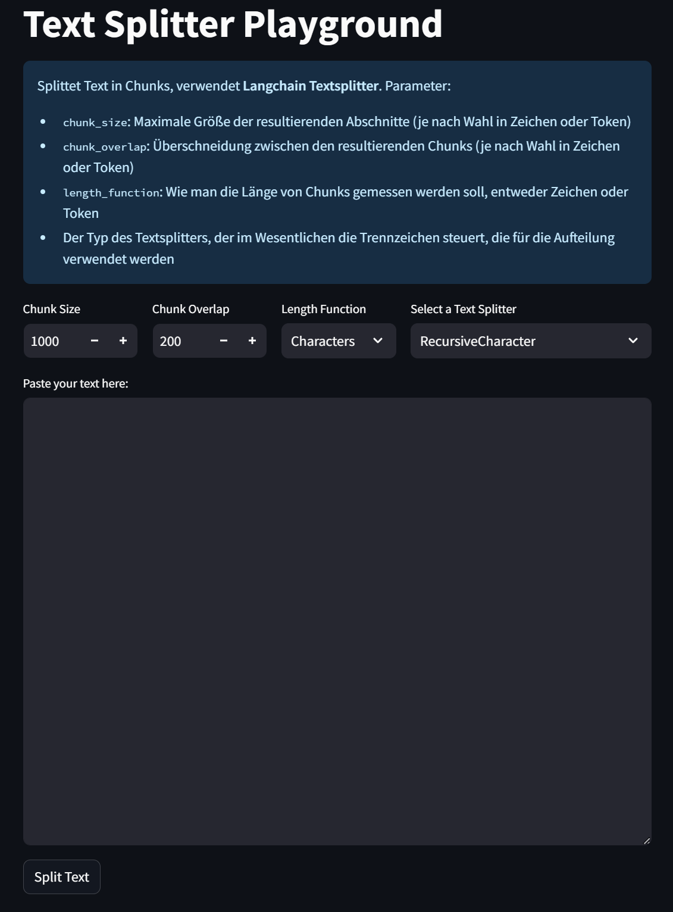

# Text Split Explorer

## fork von Harrison Chase



Bei vielen der wichtigsten LLM-Anwendungen geht es darum, LLMs mit externen Datenquellen zu verbinden. Eine Voraussetzung dafür ist, dass die Daten in ein Format gebracht werden, in dem LLMs sich leicht mit ihnen verbinden können. In den meisten Fällen bedeutet das, dass die Daten in einen Vektorspeicher gebracht werden. Eine Voraussetzung dafür ist, dass der ursprüngliche Text in kleinere Teile zerlegt wird.

Auch wenn dies trivial erscheinen mag, ist es ein differenzierter und übersehener Schritt.
Bei der Aufteilung des Textes müssen Sie sicherstellen, dass jeder Abschnitt zusammenhängende Informationen enthält, d. h. Sie wollen nicht einfach mitten im Satz aufteilen.
Was "zusammenhängende Information" bedeutet, kann je nach Textart unterschiedlich sein.
Bei Markdown gibt es z. B. Abschnittsbegrenzer (`##`), die man zusammenhalten möchte, während man beim Aufteilen von Python-Code alle Klassen und Methoden zusammenhalten möchte (wenn möglich).

Dieses Repo (und die dazugehörige Streamlit-App) soll helfen, verschiedene Arten der Textaufteilung zu erkunden.
Sie können verschiedene Parameter einstellen und verschiedene Arten von Splittern auswählen.
Wenn Sie eine Textdatei einfügen, können Sie den Splitter auf diesen Text anwenden und die resultierenden Aufteilungen sehen.
Es wird auch ein Codeschnipsel angezeigt, den Sie kopieren und in Ihrer Anwendung verwenden können.

## Hosted App

To use the hosted app, head to [https://langchain-text-splitter.streamlit.app/](https://langchain-text-splitter.streamlit.app/)

## Running locally

Um lokal zu arbeiten, richten Sie zunächst die Umgebung ein, indem Sie das Repo klonen und ausführen:

```shell
pip install -r requirements
```

Führen Sie dann die Streamlit-Anwendung mit:

```shell
streamlit run splitter.py
```
